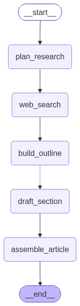

<div align="center">

# 📰 article-writer-langgraph

A [LangGraph](https://langchain-ai.github.io/langgraph/) pipeline that turns a topic into
a cited article. It plans its own search queries, gathers sources from the web, outlines
the piece, and drafts every section in parallel.


</div>

---

```bash
uv run main.py "The history of Casio watches" "a technical reader"
```

## 🔀 The flow

```
                    ┌───────────────────┐
                    │       START       │
                    └─────────┬─────────┘
                              ▼
            ┌─────────────────────────────────┐
            │  plan_research                  │◀─┐  topic + gaps ──▶ facets, queries
            └─────────────────┬───────────────┘  │
                              ▼                   │
            ┌─────────────────────────────────┐  │  queries ──▶ sources
            │  web_search                     │  │  (deduped by URL)
            └─────────────────┬───────────────┘  │
                              ▼                   │
                    ╔═══════════════════╗   gaps? └── another pass
                    ║ reseach_is_       ║   (router: coverage per facet
                    ║ sufficient        ║    below K distinct domains,
                    ╚═════════╦═════════╝    up to MAX_PASSES)
                              ▼
            ┌─────────────────────────────────┐
            │  build_outline                  │   sources ──▶ outline
            └─────────────────┬───────────────┘
                              ▼
                    ╔═══════════════════╗
                    ║ fan_out_sections  ║   router: one Send per section
                    ╚═══════╦═══╦═══╦═══╝
                  ┌─────────┘   │   └─────────┐
                  ▼             ▼             ▼
            ┌───────────┐ ┌───────────┐ ┌───────────┐
            │  draft_   │ │  draft_   │ │  draft_   │   all at once
            │  section  │ │  section  │ │  section  │
            └─────┬─────┘ └─────┬─────┘ └─────┬─────┘
                  └─────────┐   │   ┌─────────┘
                            ▼   ▼   ▼
            ┌─────────────────────────────────┐
            │  assemble_article               │   drafts ──▶ article
            └─────────────────┬───────────────┘        (sorted by index)
                              ▼
                    ┌───────────────────┐
                    │        END        │
                    └───────────────────┘
```

`reseach_is_sufficient` and `fan_out_sections` are routers rather than nodes.

`reseach_is_sufficient` checks, per facet `plan_research` has proposed, how many
*distinct domains* in `sources` speak to it — three pages from one site count as one
opinion. Any facet under `K` domains is a gap. If there are gaps and `research_passes`
hasn't hit `MAX_PASSES`, it routes back to `plan_research` with the gap list and the
`query_log` of everything already tried, so the model narrows in instead of repeating
itself. Otherwise it moves on to `build_outline`.

`fan_out_sections` emits one LangGraph `Send` per outlined section, so all the sections
get drafted at the same time. Those drafts land back in `State.drafted`, which uses an
`operator.add` reducer so the parallel writes accumulate instead of overwriting each
other. They finish in whatever order they finish, so `assemble_article` sorts by `index`
before joining them.

<details>
<summary>📐 <b>Rendered graph</b></summary>

<br>

LangGraph can draw the compiled graph itself. The current render lives in
[`flow.png`](flow.png):

<div align="center"></div>

Regenerate it with:

```python
from graph import graph

graph.get_graph().draw_mermaid_png(output_file_path="flow.png")
```

</details>

## ⚡ Quickstart

You need Python 3.12 or newer and [uv](https://docs.astral.sh/uv/).

```bash
git clone <this-repo> && cd article-writer-langgraph
uv sync
```

Drop a `.env` in the project root:

```ini
# provider:model, anything langchain's init_chat_model accepts
LLM_MODEL=openai:gpt-5.2

# the key for whichever provider LLM_MODEL names
OPENAI_API_KEY=sk-...

# web search
TAVILY_API_KEY=tvly-...
```

Then write something:

```bash
uv run main.py "How mechanical keyboards got popular again"
# uv run main.py "<topic>" "<audience>"   # audience defaults to "a technical reader"
```

<details>
<summary>🔭 <b>Optional: LangSmith tracing</b></summary>

<br>

Add these to `.env` to trace every run:

```ini
LANGSMITH_TRACING=true
LANGSMITH_API_KEY=lsv2_...
LANGSMITH_PROJECT=article-writer

# only if you are not on the US cloud. Defaults to https://api.smith.langchain.com
# LANGSMITH_ENDPOINT=https://eu.api.smith.langchain.com
```

</details>

## 📺 What a run looks like

Every step announces itself, so you can watch the article get built:

```
============================================================
🚀 Planning Research
============================================================

ℹ️  Topic: The history of Casio watches
ℹ️  Audience: a technical reader
ℹ️  Asking the model for search queries
ℹ️  Identified 4 new facets:
ℹ️    • origins and early calculator watches
ℹ️    • G-Shock development and durability testing
ℹ️  Planned 5 queries:
ℹ️    • history of Casio watches timeline key milestones  [origins and early calculator watches]
ℹ️    • G-Shock drop test development story  [G-Shock development and durability testing]

============================================================
🚀 Searching the Web
============================================================

ℹ️  Running 5 queries
ℹ️  Searching for: history of Casio watches timeline key milestones  [origins and early calculator watches]
ℹ️    Found: Casio - Wikipedia (https://en.wikipedia.org/wiki/Casio) [origins and early calculator watches]
ℹ️    Already seen: https://en.wikipedia.org/wiki/Casio
ℹ️  Collected 12 unique sources

============================================================
🚀 Planning Research
============================================================

ℹ️  Topic: The history of Casio watches
ℹ️  Audience: a technical reader
ℹ️  Asking the model for search queries
ℹ️  Planned 2 queries:
ℹ️    • G-Shock durability engineering interviews  [G-Shock development and durability testing]
ℹ️    • Casio G-Shock reviews independent teardown  [G-Shock development and durability testing]

============================================================
🚀 Searching the Web
============================================================

ℹ️  Running 2 queries
ℹ️  Searching for: G-Shock durability engineering interviews  [G-Shock development and durability testing]
ℹ️    Found: The Untold Story of G-Shock (https://example.com/g-shock-story) [G-Shock development and durability testing]
ℹ️  Collected 3 unique sources

============================================================
🚀 Building the Outline
============================================================

ℹ️  Cataloging 15 sources
ℹ️  Outlined 4 sections:
ℹ️    1. From Calculators to Timepieces (sources 1, 4, 7)

============================================================
🚀 Dispatching Sections
============================================================

ℹ️  Sending 4 sections off to be drafted:
ℹ️    1. From Calculators to Timepieces — 3 sources

...

============================================================
🚀 Assembling the Article
============================================================

ℹ️  Putting 4 sections in order:
ℹ️  Article is ready (7213 characters)


# The history of Casio watches

## From Calculators to Timepieces
...

-- 2 research_pass(es), coverage {'origins and early calculator watches': 3, 'G-Shock development and durability testing': 2}

## Sources
[1] Casio - Wikipedia - https://en.wikipedia.org/wiki/Casio
```

`reseach_is_sufficient` looped back to `plan_research` once here because the G-Shock
facet didn't yet have `K` distinct domains behind it — the second pass asked only about
that gap, steering clear of the queries already logged in `query_log`. The finished
article prints at the end, followed by the pass count, per-facet domain coverage, and a
numbered source list matching the inline `[n]` citations.

## 🗂️ Layout

One module per thing. Each package re-exports its public names, so imports stay flat:
`from nodes import plan_research`, `from schemas import State`.

```
main.py              CLI entrypoint: topic (+ optional audience) in, article out
graph.py             StateGraph wiring, exports the compiled `graph`
logger.py            colored console output
tests/               pytest suite for the pure helpers (e.g. render_brief)
```

<table>
<tr><th align="left" colspan="2">📡 <code>clients/</code>, one module per external client</th></tr>
<tr><td><code>llm.py</code></td><td><code>model</code>, from langchain's <code>init_chat_model</code></td></tr>
<tr><td><code>search.py</code></td><td><code>tavily_search</code>, a <code>TavilyClient</code></td></tr>
</table>

<table>
<tr><th align="left" colspan="2">⚙️ <code>nodes/</code>, one module per graph node</th></tr>
<tr><td><code>plan_research.py</code></td><td>topic + gaps → facets, queries</td></tr>
<tr><td><code>render_brief.py</code></td><td>topic, audience, gaps, past queries → model brief <i>(helper)</i></td></tr>
<tr><td><code>web_search.py</code></td><td>queries → sources, each tagged with the facet it targets</td></tr>
<tr><td><code>research_is_sufficient.py</code></td><td>sources → per-facet domain coverage; routes back to <code>plan_research</code> or on to <code>build_outline</code> <i>(router)</i></td></tr>
<tr><td><code>build_outline.py</code></td><td>sources → outline</td></tr>
<tr><td><code>fan_out_sections.py</code></td><td>outline → <code>Send</code>s <i>(router)</i></td></tr>
<tr><td><code>draft_section.py</code></td><td>section → drafted section</td></tr>
<tr><td><code>assemble_article.py</code></td><td>drafts → article</td></tr>
</table>

<table>
<tr><th align="left" colspan="2">🧬 <code>schemas/</code>, one module per type</th></tr>
<tr><td><code>state.py</code></td><td><code>State</code>, the graph state</td></tr>
<tr><td><code>source.py</code></td><td><code>Source</code>, tagged with the facets it supports</td></tr>
<tr><td><code>planned_query.py</code></td><td><code>PlannedQuery</code>, a query paired with the facet it targets</td></tr>
<tr><td><code>research_plan.py</code></td><td><code>ResearchPlan</code>, the facets plus <code>PlannedQuery</code> list the model returns</td></tr>
<tr><td><code>section.py</code></td><td><code>Section</code></td></tr>
<tr><td><code>outline.py</code></td><td><code>Outline</code></td></tr>
<tr><td><code>section_task.py</code></td><td><code>SectionTask</code>, the payload <code>draft_section</code> receives</td></tr>
</table>

## 🧠 State

| Key | Written by | Notes |
| :-- | :-- | :-- |
| `topic` | the caller | the input |
| `audience` | the caller | defaults to `"a technical reader"` |
| `facets` | `plan_research` | `operator.add` reducer; themes the article must cover |
| `queries` | `plan_research` | this pass's `PlannedQuery` list (query + facet) |
| `query_log` | `web_search` | `operator.add` reducer; every query ever run, so replanning avoids repeats |
| `research_passes` | `plan_research` | incremented each planning pass; caps the loop at `MAX_PASSES` |
| `sources` | `web_search` | deduplicated by URL, ids assigned in order, each tagged with the facets it supports |
| `outline` | `build_outline` | 3-6 sections, each naming the source ids it needs |
| `drafted` | `draft_section` | `operator.add` reducer, so parallel drafts accumulate |
| `article` | `assemble_article` | sections sorted by `index`, joined under `##` headings |

## 🛠️ Development

```bash
uv run pytest           # test
uv run ruff check .     # lint
uv run ruff format .    # format
```
